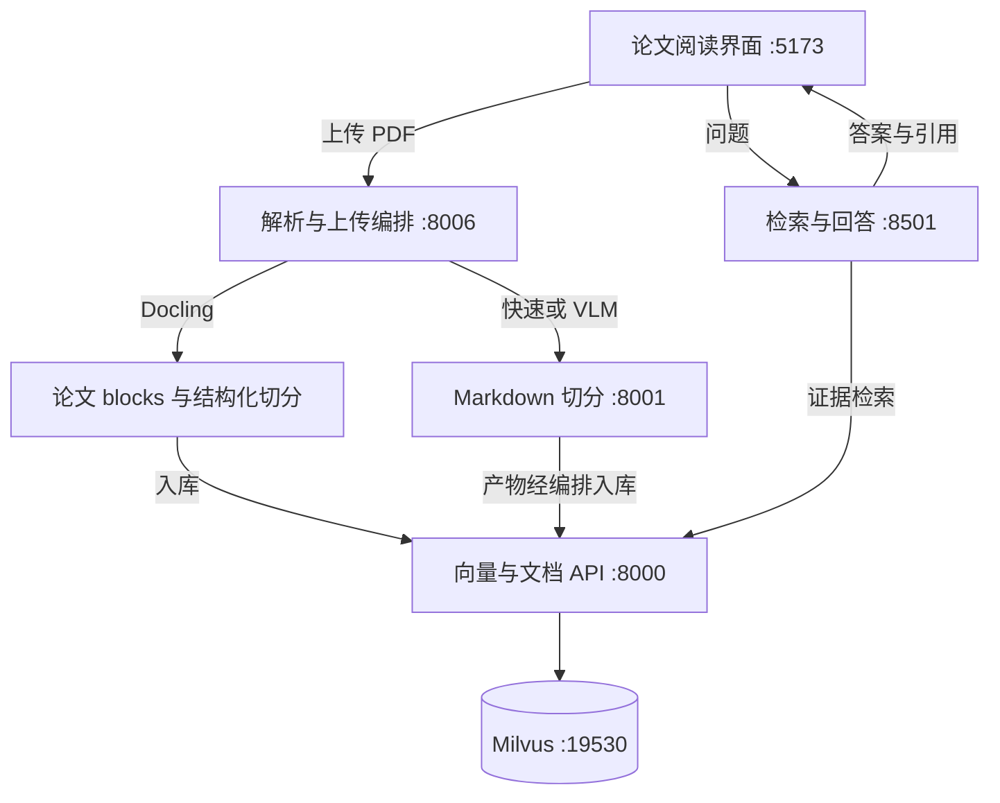

# ScholarLens

*Evidence-grounded scientific paper reading and question answering.*

---

ScholarLens 是面向学生与科研人员的论文阅读工作台：上传 PDF，围绕论文方法、公式和实验结果提问，再从回答中的引用回到论文原文。

项目的重点不是生成更长的总结，而是保留从 **论文结构 → 检索片段 → 回答引用** 的对应关系。当前为本地开发型 MVP；核心链路已有真实运行记录，实验模块与默认功能分开说明，不宣称生产就绪或所有回答均正确。

## 📋 能做什么

- **论文解析**：支持 Docling、快速文本和 VLM 模式；Docling 路径包含阅读顺序、章节层级、逻辑表，以及图/公式与正文关系的后处理。
- **结构化切分**：按正文、表格、图和公式组织 ScientificChunk，保留章节、页码、物理 block 与稳定 Chunk ID；对超长内容做有界拆分。
- **论文问答**：默认通过 Milvus Dense 检索证据，可选 BM25 + Dense + RRF 混合检索；针对可解析的显式论文名称约束检索范围，生成带 `[S1]` 等来源编号的回答。
- **原文核对**：文献库、文档详情、切片浏览、引用证据抽屉和 PDF 页码跳转；区分答案实际引用与未引用检索候选。
- **可复核评测**：覆盖解析、切分、检索、回答和引用；Evaluation Harness 保存运行快照、检查质量门并对比实验。

出处与贡献边界见 [项目说明](docs/PROJECT_OVERVIEW.md)，配置步骤见 [本地启动指南](docs/LOCAL_SETUP.md)，结果与失败记录见 [评测索引](docs/evaluation/README.md)。

## ⚙️ 当前默认与可选功能

| 项目 | 当前行为 | 边界 |
| --- | --- | --- |
| 前端 PDF 上传 | `docling`，VLM repair 关闭 | 上传 API 自身默认仍为 `fast`；API 调用需显式选择 |
| Docling 切分 | 解析服务内部的 `StructureAwareChunker` | 快速/VLM 路径使用独立切分服务 |
| 检索 | `retrieval_mode="dense"`、`top_k=10`、`score_threshold=0.1` | 前端可选 `hybrid`；含章节意图、论文范围等应用层选择逻辑 |
| 多查询规划 | `use_multi_query=false` | 禁用付费 LLM 规划；目录可解析的 2～3 篇显式命名论文仍分别检索并检查覆盖 |
| 重排序 | `use_reranker=false` | 后端可选，需额外配置服务 |
| 回答 | `answer_mode="legacy"` | `claim_bound` 为可选实验分支，未切为默认 |

Hybrid 在应用侧对当前论文范围的完整 Chunk 语料做 BM25 检索，与 Milvus Dense 候选通过等权 RRF（k=60）融合。两路使用相同的论文过滤条件；相似度阈值只作用于 Dense，不把 RRF 分数当作 cosine 或置信概率。BM25 无需额外 API Key、依赖或重建 Collection，但在线查询仍会调用原有 Embedding/生成 API。

重启向量 API 与对话后端、刷新网页，在 **模型设置 → 检索方式** 中选择 Hybrid；直接调用 `/chat` 或 `/search` 时可增加 `"retrieval_mode": "hybrid"`。当前实现每次重读并构建词法索引，最多 20,000 Chunk / 64 MiB 检索文本、15 秒扫描预算；大规模场景需要持久倒排索引等进一步设计。

Hybrid RRF 融合 **词法与语义** 两路排名；Query RRF 融合 **不同问题/论文目标** 的检索结果，二者作用不同。独立表格重识别实验和 qualified-support 核验器没有成为默认问答或解析步骤。

## 🔗 系统结构

以下展示入库与问答的数据流；Docling 的结构化切分不是强制绕经 8001 服务。



生成模型、Embedding 以及可选 VLM/Reranker 通过外部 API 调用，不属于本地 Milvus。解析后处理与切分实现位于 [unified](backend/Information-Extraction/unified)；各服务职责见 [项目说明](docs/PROJECT_OVERVIEW.md)。

## 🔧 本地运行

使用 Python 3.11、Docker Desktop，以及能够运行本项目 TypeScript 测试的 Node.js 环境；当前本机 Node 为 24.19.0。后端依赖和前端锁文件分别位于 [requirements.txt](backend/requirements.txt)、[package-lock.json](frontend/package-lock.json)。

1. 在仓库根目录按 [本地启动指南](docs/LOCAL_SETUP.md) 创建环境、安装依赖。
2. 从 [.env.example](.env.example) 创建根目录 `.env`，填写生成与 Embedding 配置；前端仅配置服务地址。
3. 启动 Milvus、四个后端服务及前端，检查健康状态后访问 `http://localhost:5173`。

安装、首次模型下载以及真实问答需要相应网络连接；Embedding、生成和可选 VLM/Reranker 可能计费。不要直接批量运行 `tests/integration` 下的 live 脚本。

## 📊 已有验证与结果边界

以下为各报告所记录的指定版本和配置，不能合并成一个整体准确率。

| 验证范围 | 已记录结果 | 不能据此声称 |
| --- | --- | --- |
| 三论文端到端开发验收 | Attention、BERT、LoRA 共 57 页、205 chunks；原始严格契约 13/16 | 所有 PDF 内容或浏览器操作均正确 |
| 文档范围修复回归 | 复用同批 16 题，在线检索/回答机械契约 16/16；无答案/空库拒答 4/4 | 泛化回答准确率或引用蕴含率 100% |
| 浏览器验收与后续修复 | 2 篇/31 页/108 chunks；初验 8 次问答核心检查 7/8，跨论文失败；修复后另行复测见报告 | 初验已全项通过、普通浏览器 PDF 跳页或所有回答已验收 |
| 当前代码回归（2026-09-28） | 当前源码 745/745，另在冻结旧版运行 134/134；前端 20/20、生产构建通过 | 879 项均验证当前源码、真实模型整体质量或生产就绪 |

详细证据：[原始多论文验收](docs/evaluation/multipaper-e2e-20260926.md)、[范围约束修复](docs/evaluation/document-scope-fix-20260926.md)、[浏览器初验](docs/evaluation/browser-final-e2e-20260927.md)、[后续修复与复测](docs/evaluation/browser-fix-followup-20260927.md)、[最新混合检索回归](docs/evaluation/hybrid-search-ab-20260928.md)。修复复测没有重新上传论文或重跑全部浏览器操作；报告中的 AI 内容核对不等于用户确认的人工 Gold。

### 混合检索对比：历史 Dense Top-10 离线回放

19 篇论文 / 2,057 Chunk；v1 共 14 题、已使用的 v2 共 24 题。下表只统计可回答题，无答案题不混入分母。

| 数据集 / 方式 | 可回答题 | 完整证据集命中率@10 | 平均证据集 Recall@10 | 证据集 MRR@10 | NDCG@10 |
| --- | ---: | ---: | ---: | ---: | ---: |
| v1 / Dense | 12 | 100% | 1.0000 | 0.6181 | 0.7274 |
| v1 / Hybrid | 12 | 100% | 1.0000 | 0.5514 | 0.6872 |
| 已使用 v2 / Dense | 20 | 75%（15/20） | 0.8500 | 0.5613 | 0.6789 |
| 已使用 v2 / Hybrid | 20 | 90%（18/20） | 0.9250 | 0.5523 | 0.6645 |

Hybrid 在 v2 找回 3 道题的完整证据，但两组的平均 MRR/NDCG 未提升，因此保留 Dense 默认。这里的 MRR 衡量完整证据集最后一个必要片段的排名，NDCG 使用不完全的 Gold 标注。

本次将**保存的 Dense Top-10** 与完整语料的 BM25 Top-10 融合，外部模型调用 0；没有重新测试线上 Top-50 候选池、生成答案、拒答或引用蕴含。两组数据此前都用过，不能称为新的独立 Held-out 成绩或回答准确率提升。完整参数、指纹和逐题退步见 [混合检索实现与 A/B](docs/evaluation/hybrid-search-ab-20260928.md)。

如需检查已冻结结果，可先使用不调用模型的 Harness 验证命令：

```powershell
python -m harness validate --config harness/configs/validated-replay-v1.json
python -m harness run --config harness/configs/hybrid-search-ab-replay-v1.json
```

`validate` 只校验配置；上述混合检索 `run` 只回放已保存结果，不调用模型。其 PASS 不是更换默认检索方式的放行。运行回放、比较和付费 live 模式的区别见 [Harness 说明](harness/README.md)。

运行当前版本无付费 API 的代码回归：

```powershell
python -X utf8 tests/run_current_suite.py
npm --prefix frontend test
npm --prefix frontend run build
```

版本化测试入口会明确分开当前源码与冻结实验；未提供旧快照时，134 项历史测试不会运行。旧快照及完整评测产物并非全部随 Git 分发，缺失时应报告不可复现，不能修改旧版 SHA 来补成通过。

## ⚠️ 已知限制

- 复杂表头、跨行跨列、扫描件、公式以及浮动图表的语义章节归属仍可能出错；已保留失败样本，未用离线特例改进替代整体效果结论。
- 来源 ID、页码和原文一致，只证明可追溯，不证明每项结论都被引用充分支持。
- 显式论文范围依赖目录名称/别名，不保证任意译名或代词解析，也不等同于用户权限隔离。
- 多论文验收中曾出现一次页面内容区空白、刷新后恢复，尚待复现；上传拖拽、取消、断网恢复等未全部完成浏览器验收。
- 当前优先收尾现有能力；暂停扩展表格与核验器实验，不自动消耗旧实验剩余调用额度。
- 历史解析验收与当前上传链路必须区分；早期解析编号的规范来源和追踪入口见 [历史解析验收索引](docs/specs/legacy_pdf_parser/acceptance.md)。追踪对齐或代码测试通过均不替代真实端到端/生产验收。
- Hybrid 尚未完成真实 Milvus/Embedding/浏览器问答 A/B，也不保证纯中文问题对英文原文的词法匹配；当前仍作为可选开发能力。

## 📚 文档导航

- [项目定位、架构与改进范围](docs/PROJECT_OVERVIEW.md)
- [环境配置、启动、检查与排错](docs/LOCAL_SETUP.md)
- [评测结果与实验索引](docs/evaluation/README.md)
- [PDF 解析设计](docs/technical/PDF_PARSING_DESIGN.md) · [VLM 页面修复](docs/technical/VLM_PAGE_REPAIR.md)
- [多查询检索](docs/technical/MULTI_QUERY_RETRIEVAL.md) · [回答引用评测](docs/technical/ANSWER_CITATION_EVALUATION.md)
- [混合检索实现、A/B 结果与复现](docs/evaluation/hybrid-search-ab-20260928.md)
- [Evaluation Harness](harness/README.md)

## 🔐 数据与项目许可

密钥和本地配置不提交 Git；上传文件、解析产物、数据库数据及运行日志按 `.gitignore` 排除。调用外部模型时，问题、论文片段或页面图像会按所选流程发往服务商，使用前应确认处理权限与费用。

当前配置面向本地开发，部分服务绑定 `0.0.0.0`，容器包含开发凭据；未经鉴权、密钥暴露面和网络边界审查，不应直接暴露到公网。

基础工程沿用已有文档 RAG 的服务划分，ScholarLens 的论文场景改进另行记录，不把整套框架或外部模型宣称为原创。仓库暂未授予开源许可证，也不改变依赖与数据集自身的许可要求。
